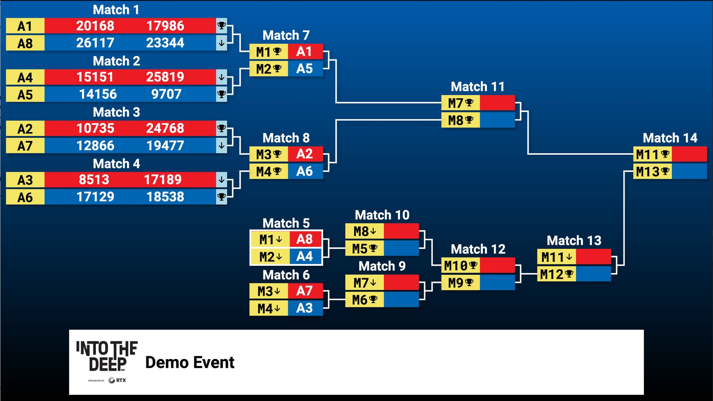

__Alliances__ are groups of teams that compete together during elimination rounds at an FTC event. After qualification matches, the top-ranked teams become alliance captains and take turns picking partner teams in what's called alliance selection. Each alliance consists of two teams (sometimes three at larger events) that play together through quarterfinals, semifinals, and finals. During qualification matches, alliances are randomly assigned — but in eliminations, captains choose strategically based on robot capabilities, OPR, and how well their robots complement each other.

