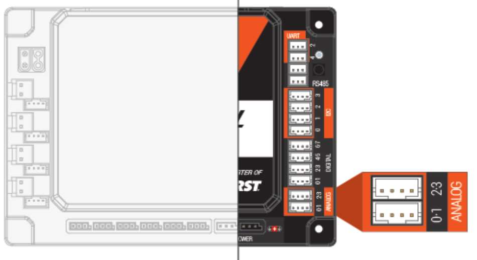

__Analog Sensors__ are a type of sensor input on the REV Control Hub and Expansion Hub that reads a continuous voltage value between 0V and 3.3V. The hub converts this voltage into a number from 0 to 1023 using a built-in ADC (analog-to-digital converter). In FTC, analog ports are used for sensors like potentiometers (to measure arm angles), some distance sensors, and flex sensors. Each hub has 4 analog input ports. Unlike digital ports which only read on/off, analog gives you a range — which is useful when you need to know exactly how far something has moved. To look into it, visit [REV](https://docs.revrobotics.com/duo-control/sensors/analog)

---

