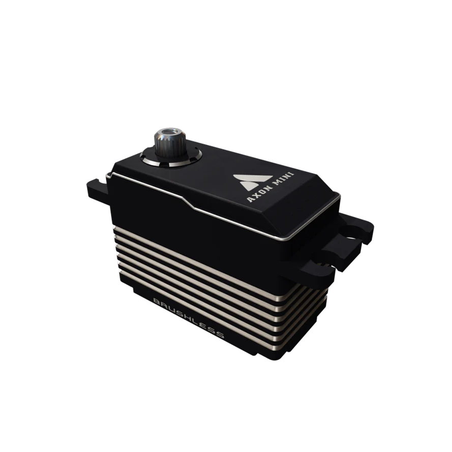

__Axon Robotics__ is an FTC parts supplier known for their high-performance programmable servos. Their flagship products — the Axon MAX+ and Axon Mini — offer significantly more torque and speed than stock REV or goBILDA servos, with built-in programmable features like adjustable speed profiles and __position feedback__. Teams use Axon servos for high-demand mechanisms like active intakes, wrist joints, and claw pivots where a standard servo would stall or be too slow. They've become increasingly popular among competitive teams looking for a servo upgrade without going full custom. To buy your own, go to [axon-robotics.com](https://axon-robotics.com/)

---

