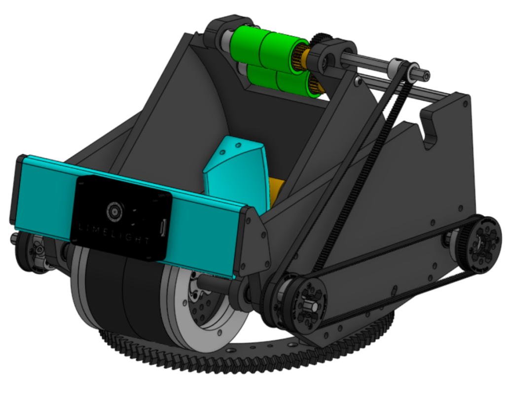

__Computer Aided Design__ is an online tool that students in FTC often use to design their robot, and subsystems. Traditionally, a platform known as onshape is used for this. Common parts like goBilda and REV can be replicated to fit into this software making an accurate depication of your robot throughout the season. To get started with this open [__onshape.com__](https://onshape.com) or visit __Onshape__ on the search bar

---

