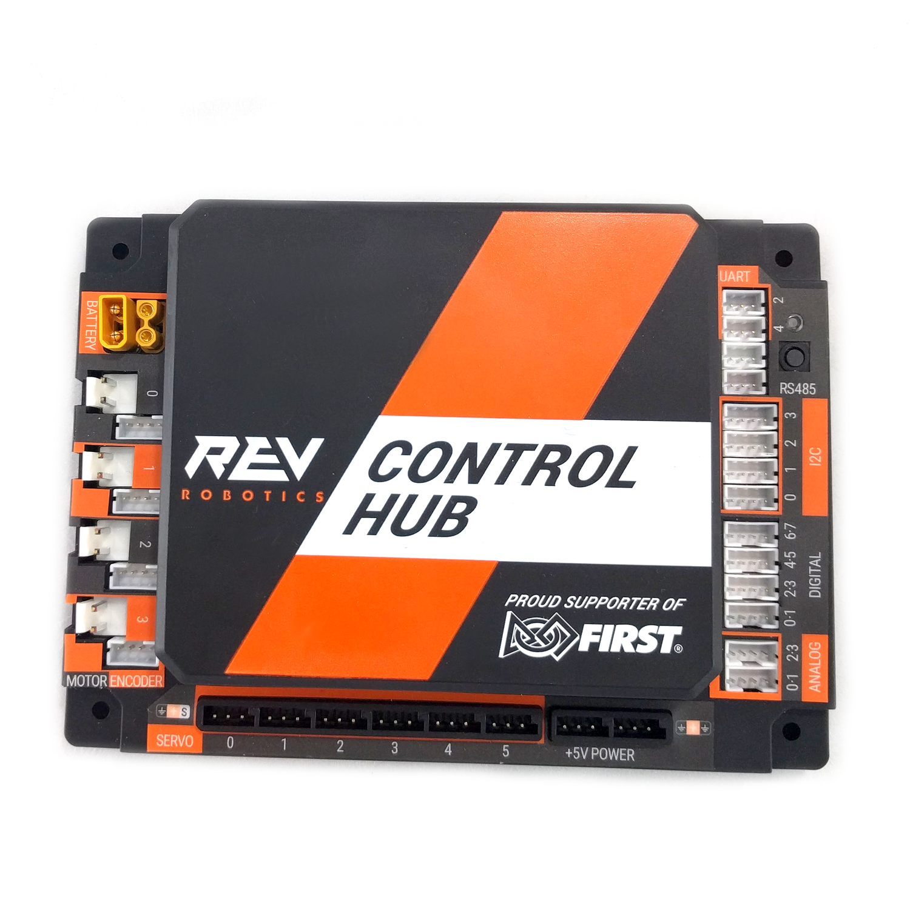

__Control Hub__ is the main brain of an FTC robot, made by [REV Robotics](https://www.revrobotics.com/). It combines an Android device and an Expansion Hub into a single unit — meaning it runs your OpModes, connects to Wi-Fi Direct for the driver station, and provides motor/servo/sensor ports __all in one box__. It has 4 __DC motor__ ports, 6 servo ports, and multiple I2C, analog, and digital sensor ports. The Control Hub replaced the old Robot Controller phone setup and is now the standard for all FTC teams. It runs the FTC Robot Controller app internally and connects to the Driver Hub over Wi-Fi Direct.

---

