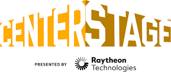

__Centerstage__ was the theatre-themed FIRST Tech Challenge game from 2023-2024. This was a complex game featuring hexagonal game objects in three colors called __pixels__. Starting in autonomous, teams would preload a purple and a yellow pixel into their robot. The purple pixel had to be placed on one of three __spike marks__, with the spike mark being determined by the location of a custom team object or another pixel. The yellow pixel would be placed vertically on a large "backdrop" with the location on the backdrop being determined by the spike mark. In teleop, teams had to stack pixels along the backdrop in patterns of three identical or three differing colors in order to make "mosaics," which provided bonus points. Reaching higher locations along the backdrop also awarded bonus points. During endgame, teams launched paper airplanes called __"drones"__ into taped off zones outside the field. The closer a drone landed to the field wall, the more points would be awarded. Teams would also __hang__ from the center structure for additional points.

---

