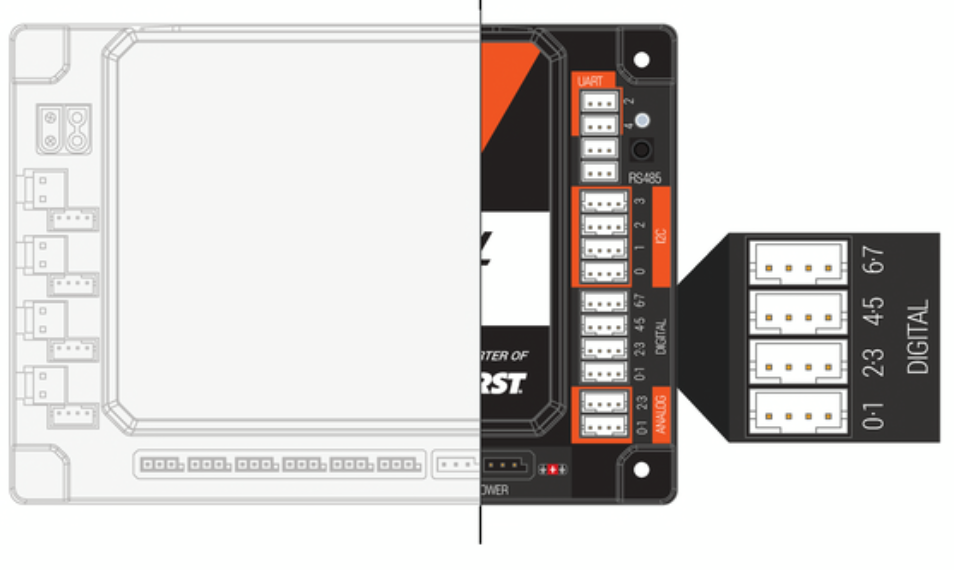

__Digital Sensor__ is a type of sensor input on the REV Control Hub and Expansion Hub that reads a simple on or off state — __HIGH__ (3.3V) or __LOW__ (0V). In FTC, digital ports are most commonly used for touch sensors and magnetic limit switches that detect when a mechanism has reached its end of travel. For example, a touch sensor at the bottom of a linear slide tells the code to stop the motor and reset the encoder. Each hub has 8 digital pins (4 ports with 2 pins each). Digital ports can also be configured as outputs to drive LEDs or signal other devices.

---

