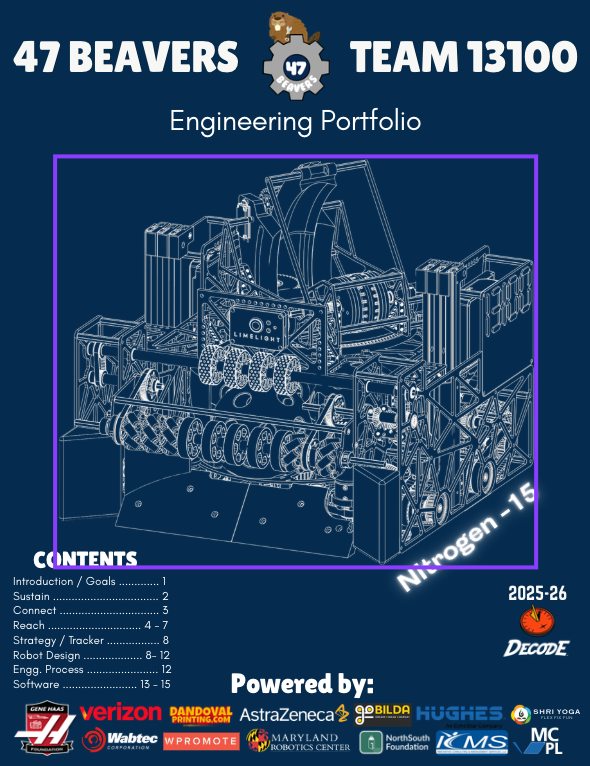

__Engineering Portfolio__ is a document that records a team's entire design process throughout the FTC season. It covers brainstorming, prototyping, CAD designs, code changes, testing data, outreach activities, and team management. Judges review the notebook during competitions, and it directly impacts awards like the Think Award and Inspire Award. Starting in recent seasons, FIRST transitioned to a digital portfolio format, but most teams still refer to it as the engineering notebook. A strong notebook shows the engineering design process — not just what you built, but why you built it that way and what you learned from failures along the way.

---

