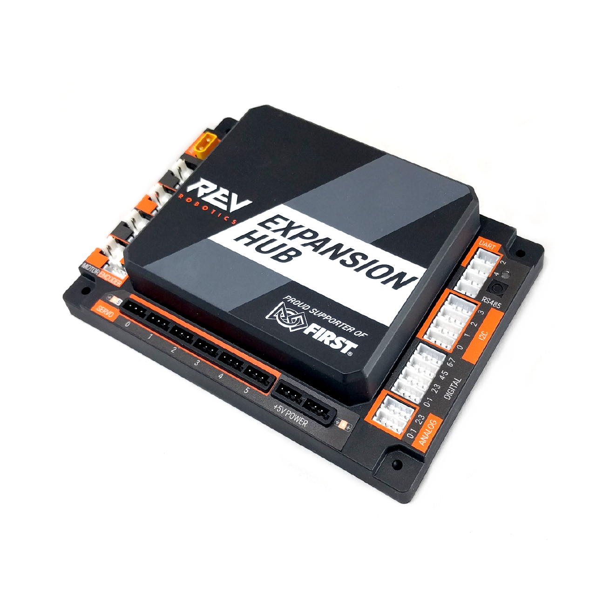

__Expansion Hub__ is an add-on board made by [REV Robotics](https://www.revrobotics.com/) that gives your robot additional motor, servo, and sensor ports. It daisy-chains to the Control Hub over RS-485 and adds another 4 DC motor ports, 6 servo ports, and a full set of I2C, analog, and digital ports. Most competitive FTC robots need an Expansion Hub because the Control Hub alone only has enough ports for a basic drivetrain — once you add an intake, slides, a claw, and sensors, you run out of ports fast. It's powered off the same 12V robot battery through the Control Hub.

---

