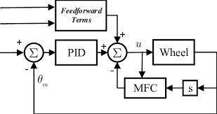

__Feedfoward__ is a PID system used to tune of how much power it needs to reach the target, which is traditionally used along side with PID, but contain values such as kS, kV, kA, any many more depending on the subsystem. Visit [ctrlaltftc.com](https://www.ctrlaltftc.com/feedforward-control) for more information on what FF is

---

