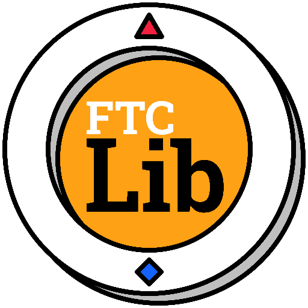

__FTCLib__ is an open-source programming library that provides tools to make robot code easier to organize and write using a command-based structure, subsystems, and built-in support for things like PID control, sensors, and autonomous routines. The latest stable version of FTCLib is v2.1.1, which was released on February 22, 2023. Check out the documentation at [docs.ftclib.org](https://docs.ftclib.org/).

---

