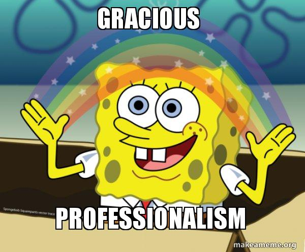

__Gracious Professionalism__ is a core value of [FIRST](https://www.firstinspires.org/) that encourages high-quality work, respect for others, and valuing everyone's contributions. In FTC, GP means helping other teams in the pits even if they're your competition, sharing spare parts, lending tools, and treating volunteers and judges with respect. It's not about being passive — it's about competing hard while still lifting others up. Teams that consistently demonstrate GP earn the respect of the entire community and often stand out during judging.

---

