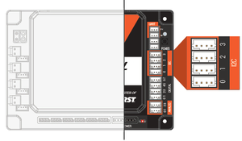

__Inter-Integrated Circuit__ or known as I2C (pronounced I squared C) is a communication protocol used to connect sensors to the Control Hub and Expansion Hub in FTC. It uses two wires — SDA (data) and SCL (clock) — and lets you __chain__ multiple sensors on the same bus as long as they have different addresses. Common I2C sensors in FTC include the REV Color Sensor V3, distance sensors, and the built-in IMU (gyroscope) inside the Control Hub. Each hub has __4__ I2C ports (bus 0–3). I2C is __slower__ than SPI but __easier__ to wire and __supported__ by more FTC-legal sensors.

---

