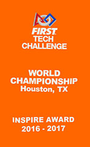

__Inspire Award__ is the highest award a team can receive at an FTC event. It goes to the team that best embodies the full [FIRST](https://www.firstinspires.org/) experience — strong robot performance, a thorough engineering notebook, community outreach, gracious professionalism, and solid teamwork. You can't just be good at one thing to win Inspire — judges are looking for a well-rounded team that excels across the board. Winning Inspire at a qualifier or regional event advances the team to the next level of competition.

---

