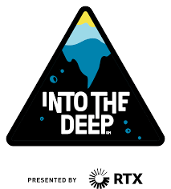

__Into The Deep__ was the aquatic-themed FIRST Tech Challenge game featured from 2024-2025. The game featured rectangular game objects with indentations on each side called __samples__. Teams would obtain these pieces from a central structure called the __submersible__ and could choose one of two methods of __scoring__. The first method was to place the samples in elevated __baskets__ on a corner of the field. The other method was to bring the sample to the human player, who would place a __clip__ on the sample, turning it into a __specimen__. The specimen would then be __hooked__ by the robot onto a team's __"chamber"__, which was a rung attached to the submersible. In endgame, teams could __climb__ metal rungs on the sides of the submersible to earn points.

---

