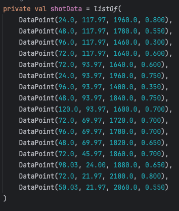

__Lookup Table__ is a concept where in the context of FTC, refers to coordinating odometry positions to certain values on subsystems. For the DECODE season, this would mean alligning odometry coordinates to hood angle and velocity for shooter, so that robots can automatically adjust to the correct shot, without any driver input, which increases drive assist. Visit [wikipedia.org](https://en.wikipedia.org/wiki/Lookup_table) for more information.

---

