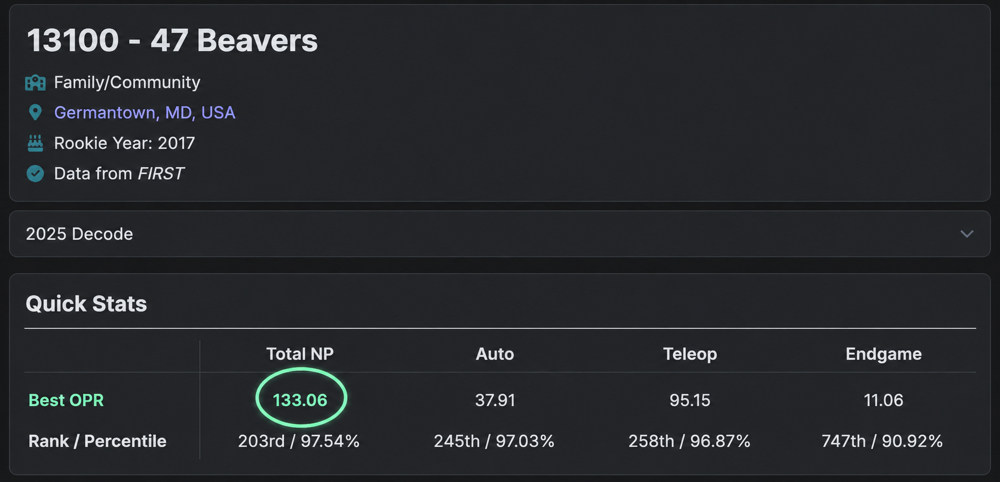

__Offensive Power Rating__ is a statistical estimate of how much a robot contributes to its alliance's score in FTC matches. The more matches played typically results in a more __accurate__ score. In order to increase your OPR, identify your alliance partner and add your team's OPR to theirs, this will be the minimum points that you have to score in that match in order to maintain or increase your OPR. Higher OPR generally indicates a _stronger_ offensive impact and overall scoring contribution during competition play. A negative opr means that you are determental to your alliance's scoring ability, which is...not a good look. To find _your_ team's OPR, visit [__ftcscout.org__](https://ftcscout.org)

---

