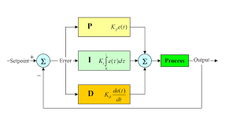

__Proportional Integral Derivative__ is a system used by programmers, requiring tuning to __maintain/better__ velocity, angle, or position of motor driven subsystems. These values are applied in the form of __kP, kI, kD__. PID is a way to improve consistency throughout your subsystem and requires an encoder wire or absolute encoder. Visit [__ctrlaltftc.com__](https://www.ctrlaltftc.com/the-pid-controller) for more information about this.

---

