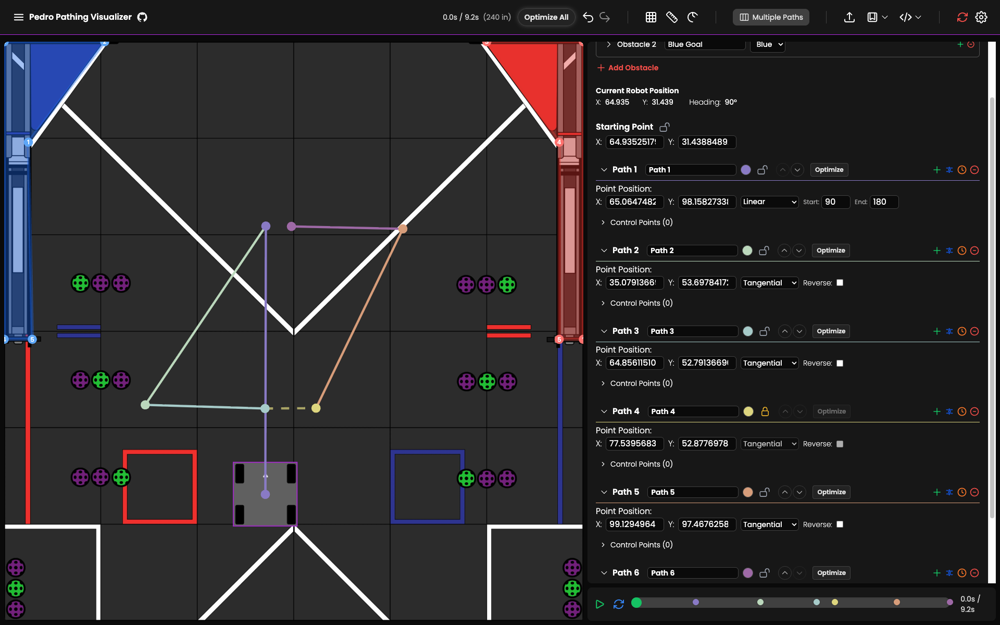

__Pedro Pathing__ is one of the most widely used autonomous path planners in FTC. It is developed by a multitude of teams themselves and is widely praised for being efficient and intuitive. This program allows teams to draw their own paths using a __visualizer__ and export it to code that the robot can follow. It also has support for various drivetrains including mecanum, coaxial swerve, differential swerve, and many others. In addition, it supports the use of multiple types of __localizer__, such as goBILDA __pinpoint__, __two wheel__ odometry, and __three wheel__ odometry. A recent update added a new command based system as well, which lets teams control the rest of their subsystems with ease. This gives teams more options in terms of how they want to program their autonomous. Visit [__pedropathing.com__](https://pedropathing.com) for more details.

---

