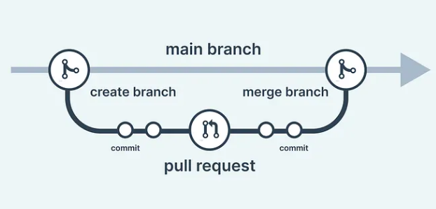

A __Pull Request__ (PR) is a request to merge code changes from one branch or fork into another branch in a __Git__ repository, usually after review and testing. For example, a tester may find an __issue__ and create code changes to fix it. Other developers can then __review__ the changes before they are __officially__ added to the main code.

---

