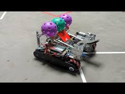

__Robot in 3 days__ is an concept for FTC and FRC teams to challenge themselves the instant a season is released, the challenge is to complete a basic robot in __3 days__ after the season comes out, in attempt to have as many game aspects somewhat __solved__ in that time. This can be applied to different challenges such as __Robot in 30 hours__ which is very common as well.

---

