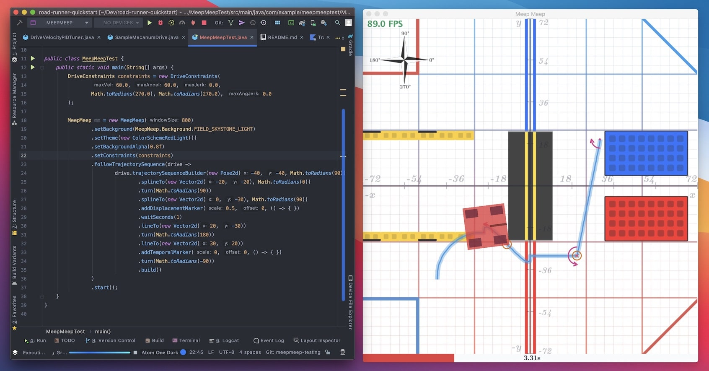

Road Runner is a type of path planner that teams can opt to use in order to help with their autonomous code development. It contains an inbuilt visualizer called __"MeepMeep"__ that helps teams visualize how their robot will move with their current code. Although it is not as commonly used now, it is still a great way for beginners to get started on their path planning journey. Visit [__Road Runner__](https://rr.brott.dev/) to get started

---

