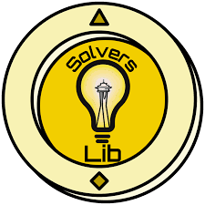

__SolversLib__ is an updated and maintained fork of the older FTCLib, created by FTC Team 23511, Seattle Solvers. One of SolversLib's modern features is easy integration with Pedro Pathing. Check out the documentation at [docs.seattlesolvers.com](https://docs.seattlesolvers.com/).

---

