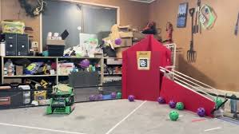

__Shoot on the move__ is a phrase used in the FTC community, popularized in the DECODE season. It essentially means that your robot is capable of shooting artifacts in DECODE __while your robot is moving__. This strategy was capable of __increasing__ cycle times since you don't need to wait to shoot, making a better alliance partner, visit [www.youtube.com](https://www.youtube.com/watch?v=P8JpxXtofnM) to see a example of this by team 19745 Turtle Walkers.

---

