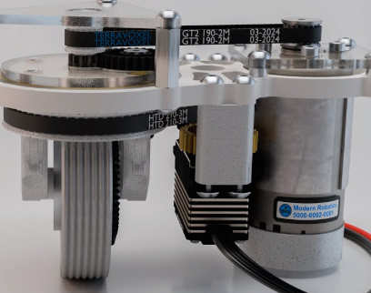

__Swerve__ is a drivetrain type that has 4 wheels, each moves in an independent direction, this means that all movements are tangent, often resulting is much faster acceleration than mecanum drive. Placing these wheels in an X shape will allow for the robot to be much harder to move, as there is opposing friction on the ground.

---

