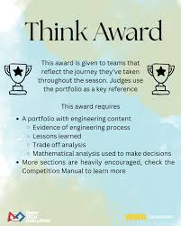

__Think Award__is an FTC judged award given to the team with the best engineering portfolio or notebook. Judges want to see a clear engineering design process — problem identification, brainstorming, prototyping, testing, iteration, and reflection. It's not about making it look pretty — it's about showing genuine thought behind every decision. Teams that win Think typically document their __failures__ just as much as their __successes__, and show how testing data drove their design changes. This award can advance teams to the next competition level.

---

