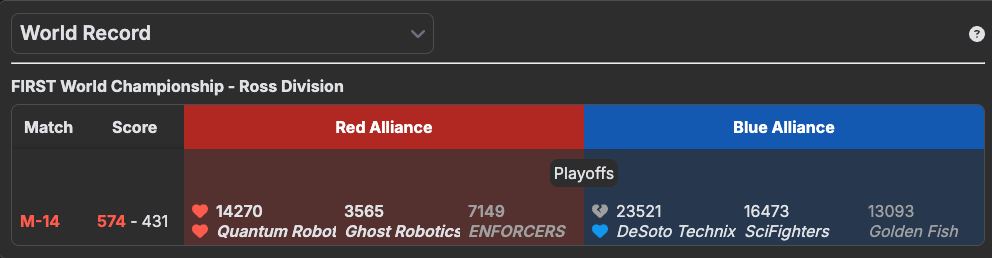

__World Record__ is the highest match score ever recorded for a particular FTC game season. World records are tracked across all official events globally and are a big deal in the community. Teams chase WRs by maximizing autonomous scoring, optimizing cycle times in TeleOp, and nailing endgame tasks consistently. Scores are tracked on sites like [FTC Scout](https://ftcscout.org/) and [The Orange Alliance](https://www.thebluealliance.com/). Holding a WR — _even briefly_ — is a __huge__ flex and puts a team on the map.

---

