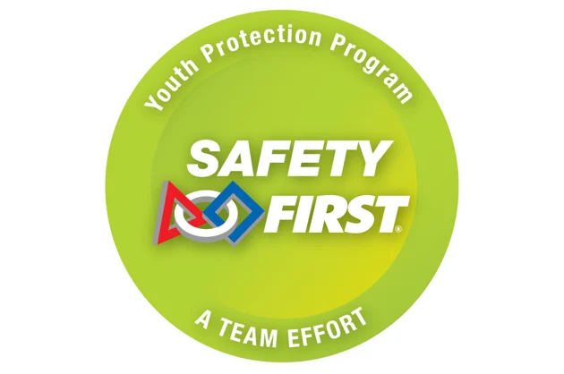

The [__Youth Protection Program__](https://www.firstinspires.org/programs/youth-protection-program) is an integral part of student safety started by __FIRST__. An example of a precedent this sets is that FIRST affiliated adults should not privately contact minors online one on one or without the presence of a coach or parent. FIRST defines it as: "The purpose of the  Youth Protection Program is to provide coaches, mentors, event volunteers, employees, Program Delivery Partners , team members, parents, guardians of team members, and others working with FIRST programs with information, guidelines, and procedures to create safe environments for participants. The Youth Protection Program sets minimum standards recommended for all  activities. Adults working in FIRST programs must be knowledgeable of the standards set by the Youth Protection Program, as well as those set by the school or organization hosting their team."

---

